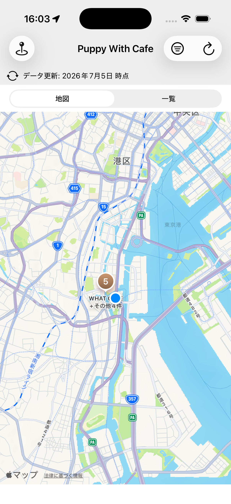

# 🐶☕ Puppy With Cafe

**愛犬と一緒に入れるカフェを、現在地から地図で探せる iOS アプリ**（コードネーム: DokoWanCafe）

<p>

</p>

| 地図で発見 | 
|---|
|  |

> 🤝 **開発を引き継ぐ人（別PC・別AIセッション）へ**: まず [`HANDOFF.md`](HANDOFF.md) を読んでください。現状・環境セットアップ・次の作業がまとまっています。

## なぜ作ったか

犬同伴OKの情報は 公式HP・Instagram・食べログ・ブログに**散乱**していて、どれが最新で正しいのか分からない。生成AIに聞くと「実際は犬OKなのに不可」と**誤答**されることさえある。

だからこのアプリは、**すべての犬同伴情報に「出典・確認日・由来」を付け、推測で「犬OK」と表示しない**ことを憲章（[constitution](.specify/memory/constitution.md)）で定めている。

## 特徴

- 📍 **現在地から地図＋一覧＋距離**で犬OKカフェを発見（クラスタリング対応）
- ✅ 可否は4値: **犬OK / 条件付き（テラスのみ等）/ 犬不可 / 未確認** — 憶測で「OK」にしない
- 🔍 全情報に**出典リンクと最終確認日**。出典間で食い違えば**矛盾をそのまま提示**
- 🤖 AI推測由来の情報は**明示ラベルで区別**
- 🕐 営業時間（🟢営業中バッジ）・犬向け設備（店内/テラス/大型犬/犬メニュー）・電話・公式リンク
- 🔒 プライバシー: 位置情報は**端末内でのみ**使用（どこにも送信しない）。アカウント不要・トラッキングなし

## アーキテクチャ（サーバーレス）

```
Google Sheet / data/master/*.csv（マスター）
   → tools/export_cafes.py（検証・矛盾解決・差分CHANGELOG）
   → data/cafes.json
       ├─ アプリにバンドル（オフライン対応）
       └─ GitHub Pages から配信（アプリ審査なしでデータ即時更新）
誤り報告: アプリ → Google フォーム → 運営レビュー → マスター反映
```

- iOS: Swift / SwiftUI（+ MapKit は UIKit 橋渡し）/ MVVM / iOS 16+ / **外部パッケージ依存ゼロ**
- データの品質はエクスポート時の**検証ゲート**で担保（条件付き⇒条件必須・確認日必須・重複検出 等）

## 開発

```bash
# ビルド & テスト（49 tests）
cd DokoWanCafe
xcodebuild test -project DokoWanCafe.xcodeproj -scheme DokoWanCafe \
  -destination 'platform=iOS Simulator,name=iPhone 17'

# データ更新（検証→差分→JSON生成）
python3 tools/export_cafes.py --check   # 検証のみ
python3 tools/export_cafes.py           # 本出力
```

- 仕様・設計: [`specs/`](specs/)（Spec-Driven Development / [Spec Kit](https://github.com/github/spec-kit)）
- データ列仕様・運用: [`tools/README.md`](tools/README.md)
- カフェ調査への参加（調査エージェント向けブリーフ）: [`research-agent/README.md`](research-agent/README.md)
- データ変更履歴: [`data/CHANGELOG.md`](data/CHANGELOG.md)
- プライバシーポリシー: [`docs/privacy.html`](docs/privacy.html)

## データについて

- 対象エリア: **東京**（順次拡大。現在: 天王洲アイル）
- 掲載情報は収集時点のものです。**お出かけ前に店舗の公式情報をご確認ください。**
- 誤りを見つけた場合は報告フォーム（アプリ内）または Issue でお知らせください。

## License

Code: MIT（予定） / カフェデータ: 出典の権利は各出典元に帰属します。
